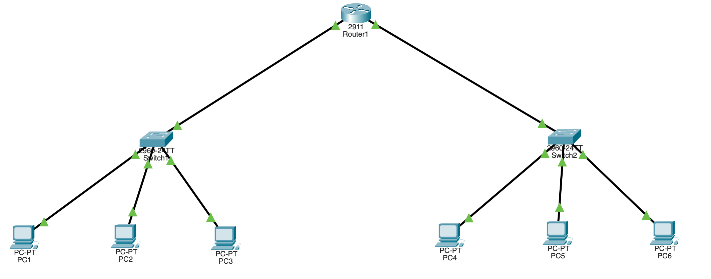

# Simple Two-Subnet Network — Cisco Packet Tracer Activity

A small routed network built in Cisco Packet Tracer. One router connects two
separate LANs (`192.168.10.0/24` and `192.168.11.0/24`), each with its own
switch and PCs. The goal is to route traffic between the two subnets and verify
connectivity with `ping`.

## Topology



```
                    ┌──────────────┐
        192.168.10.1│    Router    │192.168.11.1
             /24 ───┤     (R1)     ├─── /24
                    └──────────────┘
                     │            │
              ┌──────┴───┐   ┌────┴──────┐
              │ Switch 1 │   │ Switch 2  │
              └──────────┘   └───────────┘
              │    │    │      │    │    │
            PC1  PC2  PC3    PC4  PC5  PC6

   Network 192.168.10.0/24    Network 192.168.11.0/24
```

## Addressing table

| Device | Interface | IP Address    | Subnet Mask     | Default Gateway |
|--------|-----------|---------------|-----------------|-----------------|
| R1     | Gig0/0    | 192.168.10.1  | 255.255.255.0   | —               |
| R1     | Gig0/1    | 192.168.11.1  | 255.255.255.0   | —               |
| PC1    | Fa0       | 192.168.10.2  | 255.255.255.0   | 192.168.10.1    |
| PC2    | Fa0       | 192.168.10.3  | 255.255.255.0   | 192.168.10.1    |
| PC3    | Fa0       | 192.168.10.4  | 255.255.255.0   | 192.168.10.1    |
| PC4    | Fa0       | 192.168.11.2  | 255.255.255.0   | 192.168.11.1    |
| PC5    | Fa0       | 192.168.11.3  | 255.255.255.0   | 192.168.11.1    |
| PC6    | Fa0       | 192.168.11.4  | 255.255.255.0   | 192.168.11.1    |

## Equipment

- 1 × Router (2911)
- 2 × Switch (2960)
- 6 × PC
- Copper straight-through cables

## Router configuration (R1)

```cisco
enable
configure terminal
hostname R1

interface GigabitEthernet0/0
 ip address 192.168.10.1 255.255.255.0
 no shutdown
 exit

interface GigabitEthernet0/1
 ip address 192.168.11.1 255.255.255.0
 no shutdown
 exit

end
copy running-config startup-config
```

No routing protocol is required — both subnets are directly connected to R1, so
the router already knows the routes between them.

## PC configuration

On each PC: **Desktop → IP Configuration → Static**, then enter the IP, subnet
mask, and default gateway from the addressing table above. The default gateway
is always the router's interface on that PC's own subnet.

## Testing connectivity

1. Same subnet: from PC1, `ping 192.168.10.3` → success.
2. Across subnets: from PC1, `ping 192.168.11.2` → success (routed via R1).
3. The first ping across subnets may time out while ARP resolves — run it again.
4. Use **Simulation mode** to watch a packet travel PC → switch → router →
   switch → PC.


## Troubleshooting

| Symptom | Likely cause |
|---------|-------------|
| Ping within same subnet fails | Wrong IP/mask, or cable/link down |
| Ping to other subnet fails | Missing/incorrect default gateway on the PC |
| Router interface stays down | Forgot `no shutdown` |
| Link light red/amber | Wrong cable type or wrong port |


## Files

- `basic-routing.pkt` — the Packet Tracer project file.
- `topology.png` — topology screenshot.

