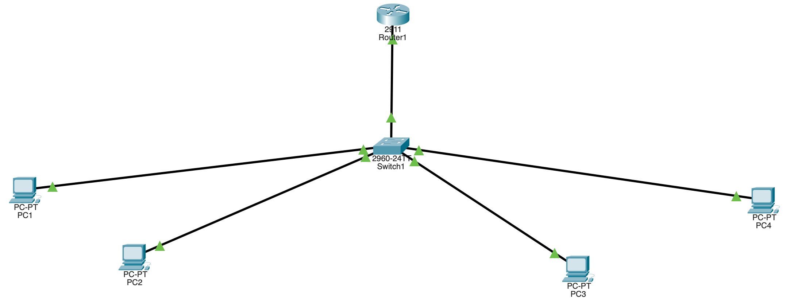

# Inter-VLAN Routing — Router-on-a-Stick (Cisco Packet Tracer)

Two VLANs on a single switch, routed through **one** router interface using
802.1Q subinterfaces and a trunk link. This is the standard real-world way to
route between VLANs, and a step up from using separate physical router ports.

## Topology

]

```
                  ┌──────────┐
                  │  Router  │  Gig0/0 (trunk, subinterfaces .10 / .20)
                  └────┬─────┘
                       │  802.1Q trunk
                  ┌────┴─────┐
                  │  Switch  │
                  └──┬────┬──┘
             VLAN10  │    │  VLAN20
             ┌───────┘    └───────┐
           PC1  PC2            PC3  PC4
```

## Addressing table

| Device          | VLAN | IP Address    | Subnet Mask     | Default Gateway |
|-----------------|------|---------------|-----------------|-----------------|
| Router G0/0.10  | 10   | 192.168.10.1  | 255.255.255.0   | —               |
| Router G0/0.20  | 20   | 192.168.20.1  | 255.255.255.0   | —               |
| PC1             | 10   | 192.168.10.2  | 255.255.255.0   | 192.168.10.1    |
| PC2             | 10   | 192.168.10.3  | 255.255.255.0   | 192.168.10.1    |
| PC3             | 20   | 192.168.20.2  | 255.255.255.0   | 192.168.20.1    |
| PC4             | 20   | 192.168.20.3  | 255.255.255.0   | 192.168.20.1    |

## Equipment

- 1 × Router (2911)
- 1 × Switch (2960)
- 4 × PC
- Copper straight-through cables

## Wiring

- Router **Gig0/0** → Switch **Gig0/1** (trunk — carries both VLANs)
- PC1, PC2 → switch **Fa0/1, Fa0/2** (VLAN 10)
- PC3, PC4 → switch **Fa0/3, Fa0/4** (VLAN 20)

## Switch configuration

```cisco
enable
configure terminal

vlan 10
 name Sales
 exit
vlan 20
 name Engineering
 exit

interface range fastEthernet0/1 - 2
 switchport mode access
 switchport access vlan 10
 exit

interface range fastEthernet0/3 - 4
 switchport mode access
 switchport access vlan 20
 exit

interface gigabitEthernet0/1
 switchport mode trunk
 exit

end
copy running-config startup-config
```

## Router configuration

```cisco
enable
configure terminal

interface gigabitEthernet0/0
 no shutdown
 exit

interface gigabitEthernet0/0.10
 encapsulation dot1Q 10
 ip address 192.168.10.1 255.255.255.0
 exit

interface gigabitEthernet0/0.20
 encapsulation dot1Q 20
 ip address 192.168.20.1 255.255.255.0
 exit

end
copy running-config startup-config
```

The subinterfaces split one physical cable into two logical gateways, one per
VLAN. `encapsulation dot1Q 10` tags traffic for VLAN 10.

## Testing connectivity

1. Same VLAN: PC1 → `ping 192.168.10.3` → success.
2. Across VLANs: PC1 → `ping 192.168.20.2` → success (routed by the router).
3. Shut the router (`interface g0/0` → `shutdown`) and the cross-VLAN ping
   fails while same-VLAN still works — proof the router is doing the routing.


## Troubleshooting

| Symptom | Likely cause |
|---------|-------------|
| Cross-VLAN ping fails | Trunk not set, or wrong `dot1Q` VLAN number |
| Same-VLAN ping fails | PC in wrong access VLAN, or wrong IP/gateway |
| Router subinterface down | Physical `g0/0` still shut down |
| All pings fail | Forgot `no shutdown` on the physical interface |

## Files

- `lab2-inter-vlan-routing.pkt` — the Packet Tracer project file.
- `topology.png` — topology screenshot.
