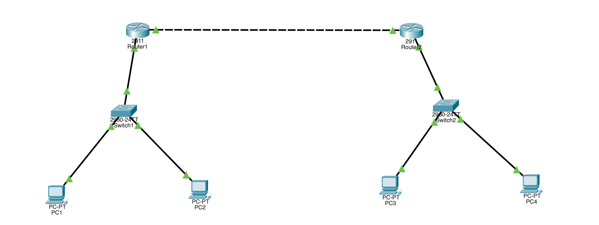

# OSPF Single-Area (Cisco Packet Tracer)

Two LANs behind two routers joined by a point-to-point WAN link. Instead of
static routes, the routers run **OSPF** and learn each other's networks
automatically. Same topology as the static routing lab — only the routing
method changes.

## Topology



```
     LAN A                                              LAN B
  192.168.1.0/24                                    192.168.2.0/24
      |                                                   |
  +-------+   Gig0/0   Gig0/1   WAN   Gig0/1   Gig0/0  +-------+
  |Switch1|----[ R1 ]==================[ R2 ]----|Switch2|
  +--+-+--+           10.0.0.1  10.0.0.2         +--+-+--+
   PC1 PC2          (10.0.0.0/30 WAN link)        PC3 PC4
```

Both routers are wired the same way: **Gig0/0 = LAN**, **Gig0/1 = WAN**.

## Equipment

- 2 × Router (2911)
- 2 × Switch (2960)
- 4 × PC
- Copper straight-through cables

## Addressing table

| Device | Interface | IP Address   | Subnet Mask       | Role      |
|--------|-----------|--------------|-------------------|-----------|
| R1     | Gig0/0    | 192.168.1.1  | 255.255.255.0     | LAN A gwy |
| R1     | Gig0/1    | 10.0.0.1     | 255.255.255.252   | WAN       |
| R2     | Gig0/0    | 192.168.2.1  | 255.255.255.0     | LAN B gwy |
| R2     | Gig0/1    | 10.0.0.2     | 255.255.255.252   | WAN       |
| PC1    | —         | 192.168.1.2  | 255.255.255.0     | GW 192.168.1.1 |
| PC2    | —         | 192.168.1.3  | 255.255.255.0     | GW 192.168.1.1 |
| PC3    | —         | 192.168.2.2  | 255.255.255.0     | GW 192.168.2.1 |
| PC4    | —         | 192.168.2.3  | 255.255.255.0     | GW 192.168.2.1 |

## R1 configuration

```
enable
configure terminal
hostname R1
interface gigabitEthernet0/0
 ip address 192.168.1.1 255.255.255.0
 no shutdown
 exit
interface gigabitEthernet0/1
 ip address 10.0.0.1 255.255.255.252
 no shutdown
 exit
router ospf 1
 network 192.168.1.0 0.0.0.255 area 0
 network 10.0.0.0 0.0.0.3 area 0
 exit
end
copy running-config startup-config
```

## R2 configuration

```
enable
configure terminal
hostname R2
interface gigabitEthernet0/0
 ip address 192.168.2.1 255.255.255.0
 no shutdown
 exit
interface gigabitEthernet0/1
 ip address 10.0.0.2 255.255.255.252
 no shutdown
 exit
router ospf 1
 network 192.168.2.0 0.0.0.255 area 0
 network 10.0.0.0 0.0.0.3 area 0
 exit
end
copy running-config startup-config
```

## Notes on the config

- `router ospf 1` — the `1` is the process ID, locally significant (it does not
  have to match between routers).
- `network ... area 0` — advertises the network and forms neighbors on matching
  interfaces. Single-area OSPF uses area 0 (the backbone).
- Wildcard masks are the inverse of the subnet mask: /24 → 0.0.0.255,
  /30 → 0.0.0.3.
- The two routers are wired symmetrically (Gig0/0 = LAN, Gig0/1 = WAN). The
  config must always match the physical cabling — confirm with `show cdp
  neighbors` if unsure.

## Verification

```
show ip ospf neighbor    ! the other router should appear in state FULL
show ip route            ! far LAN shows as O (OSPF)
```

Expected route on R1:

```
O    192.168.2.0/24 [110/2] via 10.0.0.2
```

## Testing connectivity

From PC1: `ping 192.168.2.2` — succeeds, but the route was learned dynamically
by OSPF rather than typed in by hand.

## Troubleshooting

| Symptom | Likely cause |
|---------|-------------|
| No neighbor forms | Wildcard mask wrong, or WAN interfaces not both up |
| Neighbor stuck in EXSTART/EXCHANGE | MTU mismatch on the link |
| Ping fails but routes present | PC IP/gateway wrong |
| Route missing for a LAN | `network` statement doesn't cover that interface |
| Empty neighbor table | OSPF not configured on one of the routers |
| WAN interface up/down | Other router's WAN interface not configured yet |

## Files

- `ospf.pkt` — the Packet Tracer project file.
- `topology.png` — topology screenshot.
