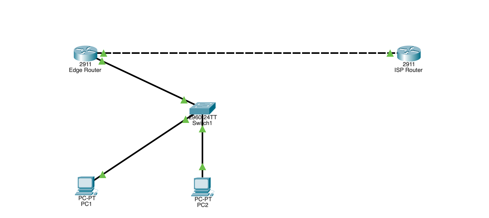

# NAT / PAT — NAT Overload (Cisco Packet Tracer)

An inside LAN with private addresses reaches an "internet" host through an edge
router that translates all private addresses to a single public IP. PAT (NAT
overload) lets many hosts share one public address by tracking port numbers —
exactly how a home router puts every device online with one ISP address.

## Topology



```
   Inside (private)                          Outside (public)
  192.168.1.0/24                              200.0.0.0/30
       |                                           |
  +-------+        +--------+  200.0.0.1  200.0.0.2  +--------+
  |Switch |--------|   R1   |========================|  ISP   |
  +-+--+--+ Gig0/0 | (edge) | Gig0/1           Gig0/0 |(router)|
    |  |    .1     +--------+                          +--------+
  PC1 PC2                                               Loopback 8.8.8.8
```

- **R1** = edge router: **Gig0/0 = inside (LAN)**, **Gig0/1 = outside (public)**.
- **ISP** = a second router standing in for the internet, reached over Gig0/0,
  with loopback 8.8.8.8 as the host the PCs ping.

## Equipment

- 2 × Router (2911)
- 1 × Switch (2960)
- 2 × PC
- Copper straight-through cables

## Addressing table

| Device | Interface  | IP Address   | Subnet Mask       | Role                |
|--------|------------|--------------|-------------------|---------------------|
| R1     | Gig0/0     | 192.168.1.1  | 255.255.255.0     | Inside (LAN gwy)    |
| R1     | Gig0/1     | 200.0.0.1    | 255.255.255.252   | Outside (public)    |
| ISP    | Gig0/0     | 200.0.0.2    | 255.255.255.252   | Link to R1          |
| ISP    | Loopback0  | 8.8.8.8      | 255.255.255.255   | "Internet" host     |
| PC1    | —          | 192.168.1.2  | 255.255.255.0     | GW 192.168.1.1      |
| PC2    | —          | 192.168.1.3  | 255.255.255.0     | GW 192.168.1.1      |

## R1 configuration (edge router)

```
enable
configure terminal
hostname R1

interface gigabitEthernet0/0
 ip address 192.168.1.1 255.255.255.0
 ip nat inside
 no shutdown
 exit

interface gigabitEthernet0/1
 ip address 200.0.0.1 255.255.255.252
 ip nat outside
 no shutdown
 exit

ip route 0.0.0.0 0.0.0.0 200.0.0.2

access-list 1 permit 192.168.1.0 0.0.0.255
ip nat inside source list 1 interface gigabitEthernet0/1 overload

end
copy running-config startup-config
```

## ISP configuration ("internet")

```
enable
configure terminal
hostname ISP

interface gigabitEthernet0/0
 ip address 200.0.0.2 255.255.255.252
 no shutdown
 exit

interface loopback0
 ip address 8.8.8.8 255.255.255.255
 exit

end
copy running-config startup-config
```

The ISP has **no route to 192.168.1.0** — and doesn't need one. It only ever
sees traffic sourced from 200.0.0.1. That is the whole point of NAT.

## What the key lines do

- `ip route 0.0.0.0 0.0.0.0 200.0.0.2` — default route ("gateway of last
  resort"); sends any unknown destination (like 8.8.8.8) toward the ISP.
- `ip nat inside` / `ip nat outside` — mark which interface faces the private
  LAN (Gig0/0) and which faces the public side (Gig0/1). NAT only works once
  both are labeled.
- `access-list 1 permit 192.168.1.0 0.0.0.255` — defines which inside addresses
  may be translated (the whole LAN).
- `ip nat inside source list 1 interface gig0/1 overload` — the NAT rule:
  translate addresses matched by list 1, using Gig0/1's public IP, and
  **overload** it (PAT) so many hosts share the one address.

## Verification

```
show ip nat translations   ! maps 192.168.1.x:port -> 200.0.0.1:port -> 8.8.8.8
show ip nat statistics     ! Inside/Outside interfaces, hit counts
show access-lists          ! confirms access-list 1 exists
```

## Testing connectivity

From PC1 (IP 192.168.1.2, gateway 192.168.1.1): `ping 8.8.8.8` — replies,
translated through R1. Then PC2 as well. Both PCs reach 8.8.8.8 using the
**same** public address (200.0.0.1); the router uses port numbers to keep the
two conversations apart. A reply with **TTL=254** confirms two router hops.

## Troubleshooting

| Symptom | Likely cause |
|---------|-------------|
| PC shows IP 0.0.0.0 | PC not configured — set a static IP + gateway |
| Ping to 8.8.8.8 fails | Missing `ip nat inside`/`outside`, or default route absent |
| `show ip nat translations` empty | ACL missing, or NAT rule points at wrong interface |
| NAT "Dynamic mappings" empty | access-list 1 not created |
| Both interfaces show as outside | LAN interface missing `ip nat inside` |
| Reaches 200.0.0.2 but not 8.8.8.8 | ISP loopback not configured, or R1 default route wrong |

## Files

- `nat.pkt` — the Packet Tracer project file.
- `topology.png` — topology screenshot.
