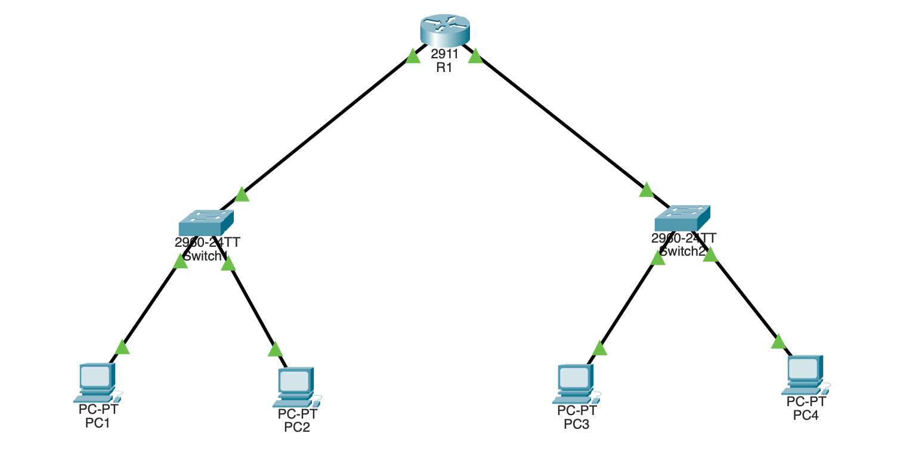

# Access Control Lists (Cisco Packet Tracer)

One router connects two LANs. An **extended ACL** blocks a single PC from
reaching the other LAN, while every other host passes normally. ACLs are the
router's traffic filter — a top-to-bottom list of permit/deny rules checked
against each packet.

## Topology



```
   LAN A (192.168.1.0/24)              LAN B (192.168.2.0/24)
       |                                     |
   +-------+     Gig0/0      Gig0/1     +-------+
   |Switch1|-------[ R1 ]-------------[ R1 ]----|Switch2|
   +--+-+--+   192.168.1.1      192.168.2.1     +--+-+--+
    |   |                                         |   |
   PC1 PC2                                       PC3 PC4
```

R1 has both interfaces (drawn twice to show each side). One router, two
switches, four PCs.

## Equipment

- 1 × Router (2911)
- 2 × Switch (2960)
- 4 × PC
- Copper straight-through cables

## Addressing table

| Device | Interface | IP Address   | Subnet Mask     | Default Gateway |
|--------|-----------|--------------|-----------------|-----------------|
| R1     | Gig0/0    | 192.168.1.1  | 255.255.255.0   | —               |
| R1     | Gig0/1    | 192.168.2.1  | 255.255.255.0   | —               |
| PC1    | —         | 192.168.1.10 | 255.255.255.0   | 192.168.1.1     |
| PC2    | —         | 192.168.1.11 | 255.255.255.0   | 192.168.1.1     |
| PC3    | —         | 192.168.2.10 | 255.255.255.0   | 192.168.2.1     |
| PC4    | —         | 192.168.2.11 | 255.255.255.0   | 192.168.2.1     |

## Step 1 — basic routing first

Bring up both interfaces so everything can talk (directly-connected routing):

```
enable
configure terminal
hostname R1
interface gigabitEthernet0/0
 ip address 192.168.1.1 255.255.255.0
 no shutdown
 exit
interface gigabitEthernet0/1
 ip address 192.168.2.1 255.255.255.0
 no shutdown
 exit
end
```

Set the PC IPs, then confirm connectivity **before** the ACL: from PC1,
`ping 192.168.2.10` should succeed. Always verify it works first, so you know
the ACL is what changes the behavior.

## Step 2 — the ACL

Block PC1 (192.168.1.10) from reaching LAN B, allow everyone else:

```
configure terminal

access-list 100 deny ip host 192.168.1.10 192.168.2.0 0.0.0.255
access-list 100 permit ip any any

interface gigabitEthernet0/0
 ip access-group 100 in
 exit

end
copy running-config startup-config
```

## What each line means

- `access-list 100` — an **extended** ACL (100–199 = extended, matches source
  and destination; 1–99 = standard, matches source only).
- `deny ip host 192.168.1.10 192.168.2.0 0.0.0.255` — deny IP from host
  192.168.1.10 to the 192.168.2.0/24 network (`0.0.0.255` = /24 wildcard).
- `permit ip any any` — allow everything else. **Critical:** every ACL ends with
  an invisible `deny all`, so without this line the ACL would block all traffic.
- `ip access-group 100 in` — apply the ACL inbound on Gig0/0 (traffic entering
  the router from LAN A).

## Step 3 — test

| From | Ping | Expected |
|------|------|----------|
| PC1 (192.168.1.10) | `ping 192.168.2.10` | Fails — blocked by the ACL |
| PC2 (192.168.1.11) | `ping 192.168.2.10` | Succeeds — not blocked |
| PC1 | `ping 192.168.1.11` | Succeeds — same LAN, ACL doesn't apply |

## Verify

```
show access-lists                        ! the ACL + a hit counter per line
show ip interface gigabitEthernet0/0     ! confirms "Inbound access list is 100"
```

After PC1's blocked pings, the `deny` line's match counter in `show access-lists`
climbs — proof the ACL is catching the traffic.

## Key concepts

- **Implicit deny:** every ACL ends with an invisible `deny all` — always add a
  `permit` for traffic you want.
- **Order matters:** the router reads top to bottom, stopping at the first match.
  The `deny` must come before `permit ip any any`.
- **Direction & placement:** `in`/`out` is from the router's perspective.
  Extended ACLs go close to the **source** (inbound on the LAN A interface here).

## Troubleshooting

| Symptom | Likely cause |
|---------|-------------|
| Everything is blocked | Missing `permit ip any any` (implicit deny hit) |
| PC1 still reaches LAN B | ACL not applied, or applied in wrong direction |
| Nothing is filtered | `deny` line placed after `permit any`, or wrong interface |
| Wrong host blocked | Host IP or wildcard in the `deny` line is off |

## Files

- `acl.pkt` — the Packet Tracer project file.
- `topology.png` — topology screenshot.
