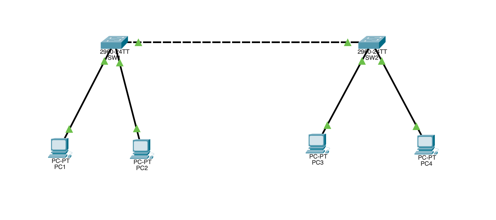

# VLAN Trunking Between Two Switches (Cisco Packet Tracer)

Two switches connected by a **trunk** link, with VLAN 10 and VLAN 20 on both.
PCs in the same VLAN can communicate across the trunk even though they sit on
different switches; different VLANs stay isolated. This is a pure Layer 2 lab —
no router.

## Topology



```
     VLAN 10        VLAN 20              VLAN 10        VLAN 20
      PC1            PC2                  PC3            PC4
       |              |                    |              |
     Fa0/1         Fa0/2                Fa0/1         Fa0/2
       +----[ SW1 ]----+    trunk    +----[ SW2 ]----+
                  Gig0/1 ============ Gig0/1
```

Two switches, four PCs, one trunk link between the switches.

## Equipment

- 2 × Switch (2960)
- 4 × PC
- Copper straight-through cables (PC to switch), copper cross-over or
  straight-through for the switch-to-switch trunk (Packet Tracer auto-MDIX
  handles either)

## Addressing table

| Device    | VLAN | IP Address    | Subnet Mask   |
|-----------|------|---------------|---------------|
| PC1 (SW1) | 10   | 192.168.10.10 | 255.255.255.0 |
| PC2 (SW1) | 20   | 192.168.20.10 | 255.255.255.0 |
| PC3 (SW2) | 10   | 192.168.10.20 | 255.255.255.0 |
| PC4 (SW2) | 20   | 192.168.20.20 | 255.255.255.0 |

No gateways needed — this lab only tests same-VLAN (Layer 2) communication, and
there is no router to route between VLANs.

## SW1 configuration

```
enable
configure terminal
hostname SW1

vlan 10
 name Sales
 exit
vlan 20
 name Engineering
 exit

interface fastEthernet0/1
 switchport mode access
 switchport access vlan 10
 exit
interface fastEthernet0/2
 switchport mode access
 switchport access vlan 20
 exit

interface gigabitEthernet0/1
 switchport mode trunk
 exit

end
copy running-config startup-config
```

## SW2 configuration

Identical, just a different hostname:

```
enable
configure terminal
hostname SW2

vlan 10
 name Sales
 exit
vlan 20
 name Engineering
 exit

interface fastEthernet0/1
 switchport mode access
 switchport access vlan 10
 exit
interface fastEthernet0/2
 switchport mode access
 switchport access vlan 20
 exit

interface gigabitEthernet0/1
 switchport mode trunk
 exit

end
copy running-config startup-config
```

## Access ports vs the trunk

- **Access ports** (Fa0/1, Fa0/2) carry **one** VLAN and connect to end devices
  (PCs). Each PC's port belongs to a single VLAN.
- **The trunk** (Gig0/1 ↔ Gig0/1) carries **all** VLANs between the switches. It
  adds an 802.1Q tag to every frame so the far switch knows which VLAN it
  belongs to. Without the trunk, VLAN 10 on SW1 and VLAN 10 on SW2 would be
  isolated islands.

## Testing connectivity

| From | Ping | Expected | Why |
|------|------|----------|-----|
| PC1 (VLAN 10, SW1) | `ping 192.168.10.20` (PC3) | Success | Same VLAN, carried across the trunk |
| PC2 (VLAN 20, SW1) | `ping 192.168.20.20` (PC4) | Success | Same VLAN across the trunk |
| PC1 (VLAN 10) | `ping 192.168.20.20` (PC4) | Fail | Different VLAN, no router to route between them |

The first two prove the trunk carries both VLANs between switches. The third
proves VLANs are still isolated (routing between them needs a router or Layer 3
switch — see the inter-VLAN routing lab).

## Verify

```
show vlan brief          ! VLAN-to-port assignments
show interfaces trunk    ! confirms Gig0/1 is a trunk + which VLANs it carries
```

`show interfaces trunk` on each switch should list Gig0/1 with VLANs 10 and 20
allowed.

## Troubleshooting

| Symptom | Likely cause |
|---------|-------------|
| Same-VLAN PCs across switches can't ping | Trunk not up — both ends must be `switchport mode trunk` |
| Trunk doesn't appear in `show interfaces trunk` | One side isn't set to trunk mode |
| PCs on same switch/VLAN can't ping | Wrong access VLAN, or PCs in different subnets |
| Different-VLAN ping works (shouldn't) | Ports accidentally in the same VLAN |

## Files

- `vlan-trunking.pkt` — the Packet Tracer project file.
- `topology.png` — topology screenshot.
