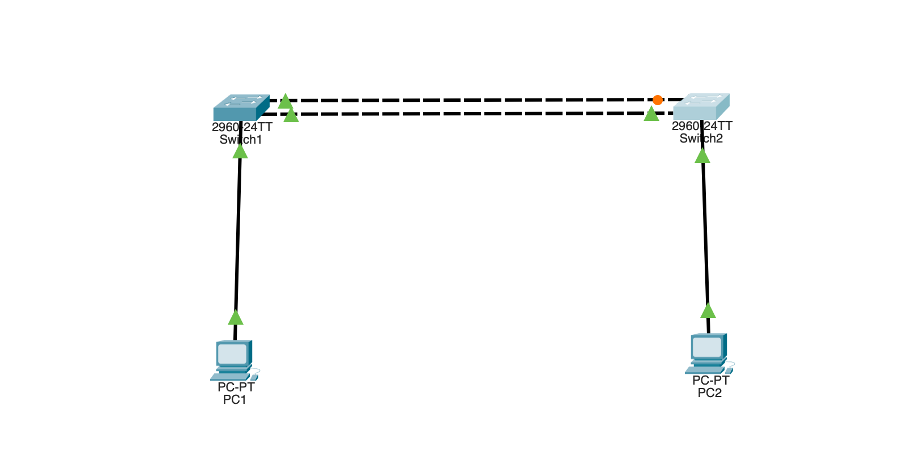

# Spanning Tree Protocol (Cisco Packet Tracer)

Two switches connected by **two** links — a deliberate loop for redundancy. STP
runs automatically and **blocks one link** to break the loop, keeping it on
standby to take over if the active link fails. No STP configuration is needed;
this lab is about observing what STP does by default.

## Topology



```
        +--------+   link 1 (Fa0/2)   +--------+
        |  SW1   |====================|  SW2   |
        | (root) |====================|        |
        +---+----+   link 2 (Fa0/3)   +----+---+
            |         (one blocked)        |
           PC1                            PC2
```

Two switches joined by two cables (the loop), plus one PC on each switch. STP
blocks one of the two inter-switch links — shown as the orange port in Packet
Tracer.

## Equipment

- 2 × Switch (2960)
- 2 × PC
- Copper cables

## Addressing table

| Device | IP Address    | Subnet Mask   |
|--------|---------------|---------------|
| PC1    | 192.168.1.10  | 255.255.255.0 |
| PC2    | 192.168.1.20  | 255.255.255.0 |

Same subnet — this is a Layer 2 lab; the PCs just need to ping each other.

## Build steps

1. Wire SW1 to SW2 with **two** cables (this creates the loop).
2. Connect PC1 to SW1 and PC2 to SW2, set their IPs.
3. Watch the link lights — after a few seconds one inter-switch port turns
   **orange (blocking)**. That is STP breaking the loop, automatically.

No STP commands are required — spanning tree is **on by default** on every switch.

## Reading the result

`show spanning-tree` on each switch shows the election outcome from this build:

- **SW1 is the root bridge** — it has the lower MAC address, so it won the
  election (both switches use the default priority 32768, so the tie broke on
  MAC). Its output says "This bridge is the root," and all its ports are
  Designated / Forwarding.
- **SW2 has the blocked port** — one inter-switch port shows role **Altn**
  (Alternate) and state **BLK** (Blocking). That is the redundant link STP shut
  down. Its other inter-switch port is the **Root** port (Forwarding), the best
  path back to SW1.

```
! SW2 example
Interface   Role  Sts  Cost   Prio.Nbr  Type
Fa0/2       Root  FWD  19     128.2     P2p
Fa0/3       Altn  BLK  19     128.3     P2p    <- blocked (breaks the loop)
```

### How the root is chosen

Root = lowest **Bridge ID** = priority + MAC address. Priorities are equal by
default (32768 + VLAN 1 = 32769), so the switch with the **lowest MAC address**
wins. Compare MACs hex digit by digit, left to right; the first difference
decides it.

## Testing connectivity

From PC1: `ping 192.168.1.20` (PC2) → succeeds. Traffic flows over the
forwarding link while the blocked link sits idle.

## The payoff — failover

1. Delete or `shutdown` the **active** inter-switch link (the one that is not
   orange).
2. Run `show spanning-tree` on SW2 again — the blocked port transitions
   **BLK → Listening → Learning → FWD** over ~30 seconds and takes over.
3. PC1 → PC2 keeps working after the brief pause.

Redundancy without loops: both cables exist for reliability, only one forwards
at a time, and the standby activates automatically if the primary fails.

## Optional — control which switch is root

Don't leave root election to chance in real networks — pick your central switch:

```
configure terminal
spanning-tree vlan 1 priority 4096
end
```

Priority must be a multiple of **4096** (only the top 4 bits of the 16-bit
priority field are settable; the lower 12 bits hold the VLAN ID). Valid values:
0, 4096, 8192, … 61440. The shortcut `spanning-tree vlan 1 root primary` sets a
low enough priority for you.

## Verify

```
show spanning-tree            ! root bridge, port roles, port states
show spanning-tree summary    ! quick overview
```

## Key concepts

- STP is **on by default** — you observe it, you don't enable it.
- **Root bridge** = lowest Bridge ID (priority + MAC), elected first.
- **Port roles:** Root (best path to root), Designated (forwarding on a segment),
  Alternate (blocked backup).
- **Port states:** Blocking → Listening → Learning → Forwarding (~30s on classic
  STP; RSTP is much faster).
- **Why it matters:** without STP, one redundant cable creates a broadcast storm
  that takes down the whole network.

## Files

- `spanning-tree.pkt` — the Packet Tracer project file.
- `topology.png` — topology screenshot (note the orange blocked port).
