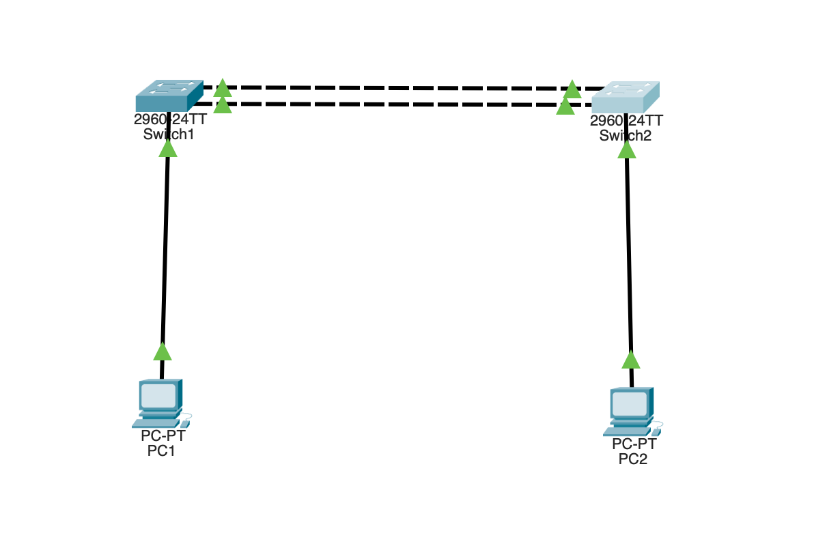

# EtherChannel — Link Aggregation (Cisco Packet Tracer)

Two switches joined by two links, bundled into a single logical **Port-channel**.
Instead of STP blocking one redundant link, EtherChannel merges both into one
connection — so both cables carry traffic (combined bandwidth), STP sees a single
link (nothing to block), and the channel survives if one link fails.

## Topology



```
        +--------+   Fa0/2   +--------+
        |  SW1   |===========|  SW2   |
        |        |===========|        |
        +---+----+   Fa0/3   +----+---+
            |     (bundled = Po1)     |
           PC1                       PC2
```

Two switches, two inter-switch links (Fa0/2 and Fa0/3), one PC each. The two
links merge into Port-channel 1. (Same topology as the STP lab — but here both
links are used instead of one being blocked.)

## Equipment

- 2 × Switch (2960)
- 2 × PC
- Copper cables

## Addressing table

| Device | IP Address    | Subnet Mask   |
|--------|---------------|---------------|
| PC1    | 192.168.1.10  | 255.255.255.0 |
| PC2    | 192.168.1.20  | 255.255.255.0 |

Same subnet — this is a Layer 2 lab; the PCs just need to ping each other.

## The key rule

Before an EtherChannel forms, the bundled ports on **each** switch must have
**identical settings** — same speed, duplex, and VLAN/mode. If the two ports
differ, the channel won't come up. This is the most common EtherChannel mistake.

## SW1 configuration

```
enable
configure terminal
hostname SW1

interface range fastEthernet0/2 - 3
 channel-group 1 mode active
 exit

end
copy running-config startup-config
```

`interface range` configures both ports at once. `channel-group 1 mode active`
bundles them into Port-channel 1 using LACP, and automatically creates the
`Port-channel1` logical interface.

## SW2 configuration

Identical:

```
enable
configure terminal
hostname SW2

interface range fastEthernet0/2 - 3
 channel-group 1 mode active
 exit

end
copy running-config startup-config
```

## Bundling modes

| Mode | Protocol | Meaning |
|------|----------|---------|
| `active` | LACP | Actively asks the other side to bundle |
| `passive` | LACP | Bundles only if the other side asks |
| `desirable` | PAgP | Cisco's version of active |
| `auto` | PAgP | Cisco's version of passive |
| `on` | none | Static — forced, no negotiation |

For LACP to form: one side `active` + the other `active` (or one active + one
passive). Both `active` is the clean, standard choice used here.

## Verify

```
show etherchannel summary
```

Expected:
```
Group  Port-channel  Protocol   Ports
1      Po1(SU)       LACP       Fa0/2(P)  Fa0/3(P)
```

- **Po1(SU)** — the channel is Switched and Up.
- **Fa0/2(P) Fa0/3(P)** — both ports are bundled (P) in the channel.

```
show spanning-tree
```

Now shows **Po1** as a single interface with **no blocked ports** — STP treats
the bundle as one link, so nothing is blocked (unlike the STP lab, where Fa0/3
was `Altn BLK`).

## Testing connectivity

From PC1: `ping 192.168.1.20` (PC2) → succeeds, using the aggregated link.

## The payoff — failure test

`shutdown` or delete **one** physical link (e.g. Fa0/2). Run
`show etherchannel summary` again — the channel stays **up** on the remaining
link (Fa0/3), and PC1 → PC2 keeps working with **no interruption** (unlike STP,
which needs ~30 seconds to fail over). Both links were active the whole time.

## STP vs EtherChannel

| | STP | EtherChannel |
|--|-----|--------------|
| Redundant links | One blocked (wasted) | Both active (combined bandwidth) |
| Failover | ~30 seconds | Instant |
| STP view | Blocks a port | Sees one logical link |

## Troubleshooting

| Symptom | Likely cause |
|---------|-------------|
| Channel won't come up | Bundled ports have mismatched settings (speed/duplex/VLAN) |
| Ports show (I) not (P) | Ports individual, not bundled — mode mismatch between switches |
| One side active, other on | Mode mismatch — LACP `active` won't bundle with static `on` |
| Po1 down (SD) | Both physical links down, or config only on one switch |

## Files

- `etherchannel.pkt` — the Packet Tracer project file.
- `topology.png` — topology screenshot.
