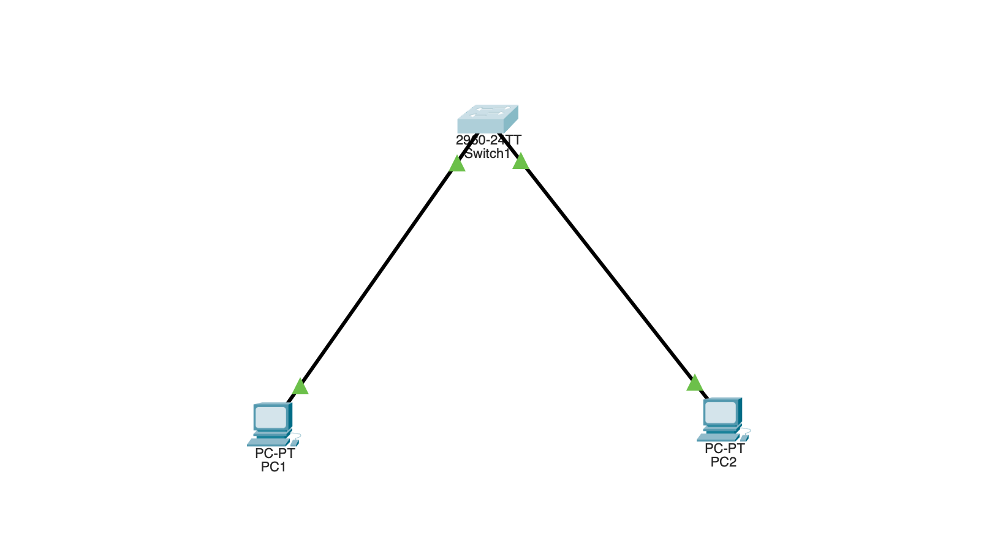

# Port Security (Cisco Packet Tracer)

Lock a switch access port to a single authorized device by MAC address. If a
different device is plugged into the port, the switch detects the mismatch and
shuts the port down automatically — stopping unauthorized devices and MAC-based
attacks.

## Topology



```
        +--------+
        |  SW1   |
        +---+----+
         Fa0/1  Fa0/2
           |      |
          PC1    PC2
     (authorized) (test / rogue)
```

One switch, two PCs. PC1 is the authorized device on the secured port (Fa0/1);
PC2 is used to test a violation.

## Equipment

- 1 × Switch (2960)
- 2 × PC
- Copper cables

## Addressing table

| Device | IP Address    | Subnet Mask   |
|--------|---------------|---------------|
| PC1    | 192.168.1.10  | 255.255.255.0 |
| PC2    | 192.168.1.20  | 255.255.255.0 |

## SW1 configuration — secure Fa0/1

```
enable
configure terminal
hostname SW1

interface fastEthernet0/1
 switchport mode access
 switchport port-security
 switchport port-security maximum 1
 switchport port-security violation shutdown
 switchport port-security mac-address sticky
 exit

end
copy running-config startup-config
```

## What each line does

- `switchport mode access` — port security only works on access ports, so set
  this first.
- `switchport port-security` — turns the feature on for the port.
- `switchport port-security maximum 1` — allow only 1 MAC address on the port.
- `switchport port-security violation shutdown` — if a different MAC appears,
  shut the port down (err-disabled). Strictest action; this is the default.
- `switchport port-security mac-address sticky` — automatically learn and save
  the first device's MAC, instead of typing it by hand.

## Testing

### 1. Learn the authorized MAC

From PC1, generate traffic so the port learns and "stickies" its MAC:

```
ping 192.168.1.20
```

On SW1, confirm it was learned:

```
show port-security address
```

PC1's MAC appears as a **SecureSticky** address on Fa0/1.

### 2. Trigger a violation

1. Delete the cable from PC1 to Fa0/1.
2. Connect PC2 (a different MAC) to Fa0/1.
3. Have PC2 send traffic (ping something).

The switch sees a different MAC than the one it locked to → violation →
**Fa0/1 goes err-disabled (shuts down)**. The port light turns red.

### 3. Verify the violation

```
show port-security interface fastEthernet0/1
```

Look for:
- **Port Status: Secure-shutdown**
- **Violation count: 1**

### 4. Recover an err-disabled port

After fixing the cause, bounce the port to bring it back:

```
configure terminal
interface fastEthernet0/1
 shutdown
 no shutdown
 exit
end
```

## Violation modes

| Mode | Action on violation |
|------|---------------------|
| `shutdown` (default) | Port goes err-disabled (fully off); must be manually re-enabled |
| `restrict` | Drops the bad traffic, logs it, increments a counter — port stays up |
| `protect` | Silently drops the bad traffic — no log, no counter |

## Verify commands

```
show port-security                              ! summary of all secured ports
show port-security interface fastEthernet0/1    ! detail + violation count
show port-security address                      ! the learned (sticky) MACs
```

## Why it matters

Port security stops unauthorized devices and MAC-flooding attacks (where an
attacker floods the switch's MAC table to make it behave like a hub and leak
traffic). Limiting MACs per port and shutting down on violation is a core Layer 2
hardening step.

## Troubleshooting

| Symptom | Likely cause |
|---------|-------------|
| `command rejected` on port-security lines | Port not set to `switchport mode access` first |
| Port immediately err-disabled | A second MAC already seen, or maximum set too low |
| Sticky MAC not learned | No traffic sent from the device yet |
| Port won't come back up | Still err-disabled — must `shutdown` then `no shutdown` |

## Files

- `port-security.pkt` — the Packet Tracer project file.
- `topology.png` — topology screenshot.
