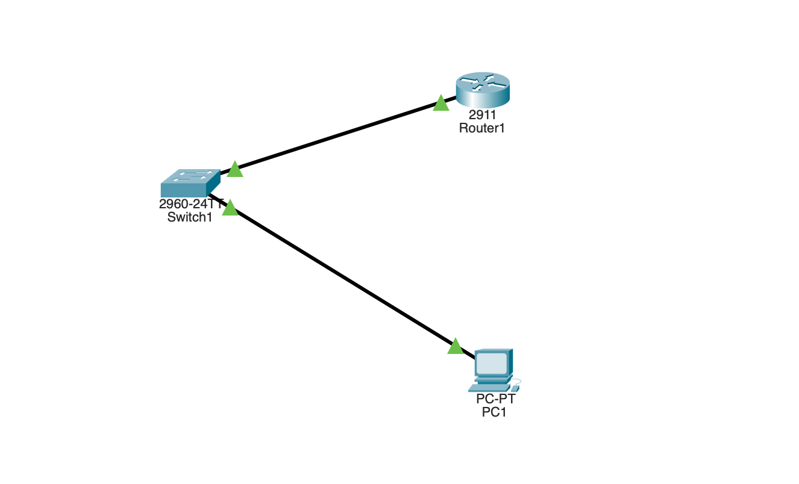

# SSH & Device Hardening (Cisco Packet Tracer)

Configure a router for **encrypted remote management** with SSH (instead of
plain-text Telnet), then apply the core device-hardening commands every real
device should have. Tested by SSHing to the router from a PC.

## Topology



```
        +--------+     +--------+     +--------+
        |  PC1   |-----| Switch |-----|   R1   |
        | (admin)|     |        |     |        |
        +--------+     +--------+     +--------+
       192.168.1.10                 Gig0/0: 192.168.1.1
```

One router (the device being secured), one switch, one PC (the admin
workstation that connects over SSH).

## Equipment

- 1 × Router (2911)
- 1 × Switch (2960)
- 1 × PC
- Copper straight-through cables

## Addressing table

| Device | Interface | IP Address    | Default Gateway |
|--------|-----------|---------------|-----------------|
| R1     | Gig0/0    | 192.168.1.1   | —               |
| PC1    | —         | 192.168.1.10  | 192.168.1.1     |

## Step 1 — basic connectivity

```
enable
configure terminal
hostname R1
interface gigabitEthernet0/0
 ip address 192.168.1.1 255.255.255.0
 no shutdown
 exit
end
```

Set PC1 to 192.168.1.10 (gateway 192.168.1.1), then confirm `ping 192.168.1.1`
works before configuring SSH.

## Step 2 — configure SSH (do this from the router console)

```
configure terminal

! hostname + domain (required before generating the crypto key)
hostname R1
ip domain-name lab.local

! REQUIRED for privileged mode over SSH — set this before testing remote login.
! Without an enable secret, "enable" over SSH fails with "% No password set".
enable secret class123

! local username/password for login
username admin secret cisco123

! generate the RSA key pair that encrypts SSH (enter 1024 for the modulus)
crypto key generate rsa

! force SSH version 2
ip ssh version 2

! secure the VTY lines: SSH only, authenticate against local users
line vty 0 4
 transport input ssh
 login local
 exit

end
copy running-config startup-config
```

### What each piece does

- `hostname` + `ip domain-name` — the RSA key name is built from these, so both
  are required **before** `crypto key generate rsa`.
- `enable secret class123` — the privileged-mode password. **Critical:** over a
  remote session (SSH/VTY) you cannot enter privileged mode (`R1#`) unless an
  enable secret is set. It must be configured from the console *before* you try
  to `enable` over SSH — otherwise you get "% No password set".
- `username admin secret cisco123` — a local account; `login local` makes the
  VTY lines check it.
- `crypto key generate rsa` (1024-bit) — creates the keys that make SSH secure;
  this is the step that actually enables SSH.
- `transport input ssh` — VTY lines accept **only SSH**, refusing Telnet.
- `login local` — authenticate against the local username database.

## Step 3 — test SSH from PC1

On PC1's Command Prompt:

```
ssh -l admin 192.168.1.1
```

Enter the login password (`cisco123`). You land on the `R1>` prompt over an
encrypted session — SSH is working. To reach privileged mode:

```
enable
```

Enter the enable secret (`class123`) → you get `R1#`. (This only works because
the enable secret was set in Step 2. Without it, remote `enable` is blocked.)

## Step 4 — additional device hardening

```
configure terminal

! encrypt all plain-text passwords in the config
service password-encryption

! console (physical) access password
line console 0
 password consolepass
 login
 exit

! auto-logout idle sessions after 5 minutes
line vty 0 4
 exec-timeout 5 0
 exit

! legal warning banner
banner motd #Unauthorized access is prohibited.#

end
copy running-config startup-config
```

### Hardening commands explained

- `enable secret` (set in Step 2) — privileged-mode password, stored encrypted
  (unlike the old `enable password`). Also required for remote privileged access.
- `service password-encryption` — scrambles all plain-text passwords in the
  config.
- `line console 0` + `password`/`login` — requires a password for physical
  console access.
- `exec-timeout 5 0` — logs out idle sessions after 5 minutes.
- `banner motd` — legal warning shown at login.

## Verify

```
show ip ssh            ! SSH version and status (should say Enabled, version 2.0)
show ssh               ! active SSH sessions
show running-config    ! confirm encrypted passwords + VTY set to ssh only
```

## Optional — restrict who can SSH (standard ACL on VTY)

The classic standard-ACL use case — allow SSH only from PC1:

```
access-list 10 permit host 192.168.1.10
line vty 0 4
 access-class 10 in
```

Now only 192.168.1.10 can even attempt an SSH connection.

## Why it matters

- **SSH vs Telnet:** Telnet sends passwords in clear text (trivially sniffed);
  SSH encrypts the session. Never use Telnet in production.
- **Hardening:** default devices are wide open. `enable secret`, encrypted
  passwords, idle timeouts, and login banners are baseline security for every
  real device.

## Troubleshooting

| Symptom | Likely cause |
|---------|-------------|
| `% No password set` when `enable` over SSH | No enable secret — set `enable secret` from the console first (privileged mode over SSH requires it) |
| `crypto key generate rsa` rejected | hostname or `ip domain-name` not set first |
| SSH connection refused | VTY missing `transport input ssh` or `login local` |
| Login fails | No local `username`, or wrong password |
| `conf t` rejected at `R1>` | You're in user mode — `enable` into privileged mode (`R1#`) first |
| Telnet still works | VTY still allows telnet — set `transport input ssh` |
| PC can't reach router | IP/gateway wrong, or interface down |

## Files

- `ssh-hardening.pkt` — the Packet Tracer project file.
- `topology.png` — topology screenshot.
