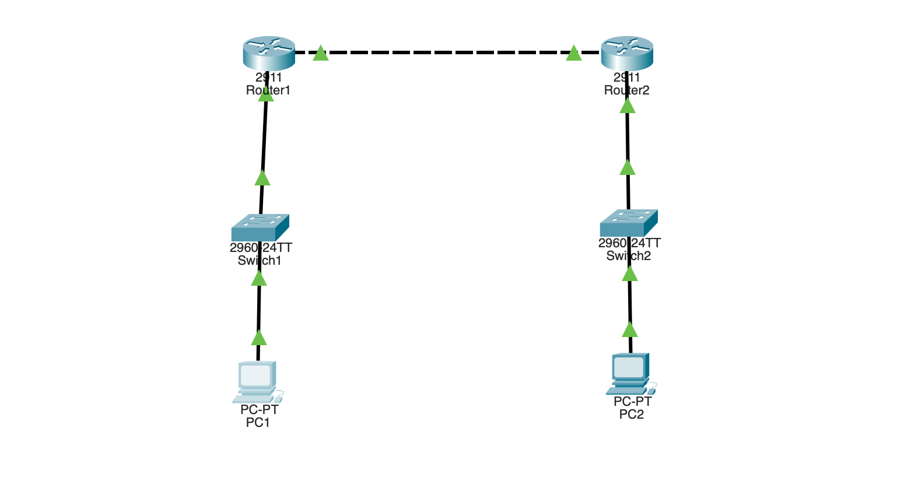

# OSPFv3 — OSPF for IPv6 (Cisco Packet Tracer)

Two routers running **OSPFv3**, the IPv6 version of OSPF. Instead of typing
`ipv6 route` static routes by hand, the routers advertise their IPv6 networks
and learn each other's routes automatically. Same topology as the IPv6 lab —
only the routing method changes.

## Topology



```
   LAN A                                          LAN B
2001:DB8:A::/64                            2001:DB8:B::/64
     |                                            |
  +-------+  G0/0     WAN 2001:DB8:C::/64   G0/0  +-------+
  |Switch1|--[ R1 ]==========================[ R2 ]--|Switch2|
  +---+---+       Gig0/1            Gig0/0        +---+---+
    PC1                                            PC2
```

Both routers connect the LAN on Gig0/0 and the WAN on Gig0/1 (R1) / Gig0/0 (R2)
— match the config to your actual cabling.

## Equipment

- 2 × Router (2911)
- 2 × Switch (2960)
- 2 × PC
- Copper straight-through cables

## Addressing table (IPv6)

| Device | Interface   | IPv6 Address       | Role            |
|--------|-------------|--------------------|-----------------|
| R1     | Gig0/0      | 2001:DB8:A::1/64   | LAN A gateway   |
| R1     | Gig0/1      | 2001:DB8:C::1/64   | WAN             |
| R2     | Gig0/0      | 2001:DB8:C::2/64   | WAN             |
| R2     | Gig0/1      | 2001:DB8:B::1/64   | LAN B gateway   |
| PC1    | —           | 2001:DB8:A::10/64  | GW 2001:DB8:A::1 |
| PC2    | —           | 2001:DB8:B::10/64  | GW 2001:DB8:B::1 |

## How OSPFv3 differs from IPv4 OSPF

- **No `network` statements** — OSPFv3 is enabled **per-interface** with
  `ipv6 ospf 1 area 0` on each interface, not with `network ... area 0`.
- **Router-id is required** and must be in **IPv4 format** (32-bit, e.g.
  `1.1.1.1`) — even though it routes IPv6. OSPF's router ID has always been a
  32-bit value.
- Everything else (areas, neighbors, FULL state, the `O` route) works the same.

## Step 0 — remove old static routes (if reusing the IPv6 lab)

```
! On R1:
configure terminal
no ipv6 route 2001:DB8:B::/64 2001:DB8:C::2
end

! On R2:
configure terminal
no ipv6 route 2001:DB8:A::/64 2001:DB8:C::1
end
```

## R1 configuration

```
enable
configure terminal

ipv6 unicast-routing

ipv6 router ospf 1
 router-id 1.1.1.1
 exit

interface gigabitEthernet0/0
 ipv6 ospf 1 area 0
 exit

interface gigabitEthernet0/1
 ipv6 ospf 1 area 0
 exit

end
copy running-config startup-config
```

## R2 configuration

```
enable
configure terminal

ipv6 unicast-routing

ipv6 router ospf 1
 router-id 2.2.2.2
 exit

interface gigabitEthernet0/0
 ipv6 ospf 1 area 0
 exit

interface gigabitEthernet0/1
 ipv6 ospf 1 area 0
 exit

end
copy running-config startup-config
```

## What each part does

- `ipv6 unicast-routing` — required; IPv6 routing is off by default.
- `ipv6 router ospf 1` + `router-id 1.1.1.1` — starts the OSPFv3 process and sets
  a manual router ID (required; use a unique IPv4-format ID per router).
- `ipv6 ospf 1 area 0` on each interface — enables OSPFv3 directly on the
  interface (the key difference from IPv4 OSPF's `network` statements). Apply it
  to every interface OSPF should run on.

## Set the PCs

Each PC → **Desktop → IP Configuration → IPv6 section**:

- PC1: IPv6 `2001:DB8:A::10`, prefix `64`, gateway `2001:DB8:A::1`
- PC2: IPv6 `2001:DB8:B::10`, prefix `64`, gateway `2001:DB8:B::1`

## Testing connectivity

From PC1: `ping 2001:DB8:B::10` (PC2) → succeeds, but the route was learned
dynamically by OSPFv3 rather than typed in as a static route.

## Verify

```
show ipv6 ospf neighbor      ! the other router should appear in state FULL
show ipv6 route ospf         ! learned routes show with an O
show ipv6 protocols          ! confirms OSPFv3 is running
```

Expected: the neighbor in **FULL** state, and the far LAN in the routing table
marked with an **O** (learned via OSPF).

## Troubleshooting

| Symptom | Likely cause |
|---------|-------------|
| No neighbor forms | `ipv6 ospf 1 area 0` missing on the WAN interface (one or both routers) |
| `% OSPF: Router process 1 is not running` | Router-id not set — OSPFv3 needs a manual router-id |
| Neighbor stuck in EXSTART/EXCHANGE | MTU mismatch on the link |
| No routes learned | `ipv6 unicast-routing` not enabled |
| Ping fails but routes present | PC IPv6 / prefix / gateway wrong |

## Why it matters

Dynamic routing scales; static routes don't. OSPFv3 brings the automatic
route-learning of OSPF to IPv6 networks. Knowing the per-interface config style
and the mandatory IPv4-format router-id is the main thing that separates OSPFv3
from the IPv4 OSPF you already know.

## Files

- `ospfv3.pkt` — the Packet Tracer project file.
- `topology.png` — topology screenshot.
